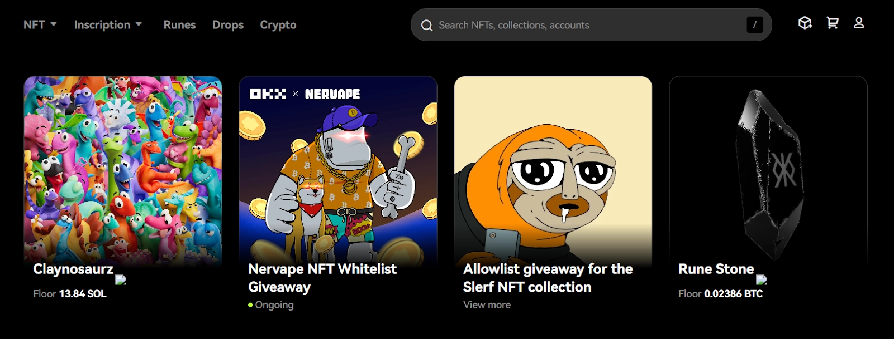

# OKX Review: Trading Features, Fees, and Security Deep Dive

Looking for a crypto exchange that combines serious trading volume with reasonable fees? OKX ranks fourth globally for trading volume and liquidity, making it worth considering if you're after spot and futures trading with proper depth. This review breaks down what actually works, what doesn't, and whether this platform fits your trading style.

---

**Key Points**:
- Buy and sell 327+ digital assets using EUR, USD, and other fiat currencies via bank transfers, credit cards, or debit cards
- Access spot trading, derivatives markets, staking, copy trading, and DeFi tools including swaps and an NFT marketplace
- Trading fees start at 0.08% for makers and 0.1% for takers in spot markets, 0.02% for makers and 0.05% for takers in futures, with zero deposit and withdrawal fees

---

## What is OKX (Formerly OKEx)?

👉 [Discover why traders choose OKX for high-volume trading with deep liquidity](https://www.okx.com/join/47044926)

OKX, previously called OKEx exchange, is a global crypto trading platform that handles serious volume. Star Xu founded it in 2017. The company rebranded from OKEx to OKX in 2022. They operate in over 100 countries with offices in UAE, Hong Kong, Singapore, Silicon Valley, and the Bahamas. The exchange runs through entities incorporated in Seychelles and registered in the Bahamas. In the United States, OKX offers Web3 services with a Silicon Valley office but doesn't provide centralized exchange services.

The platform supports over 327 digital assets and 533 trading pairs. You'll find Bitcoin (BTC), Ethereum (ETH), Dogecoin (DOGE), Tether (USDT), and plenty more. Buying and selling works with over 100 fiat currencies and 900+ local payment methods worldwide.

For traders who know what they're doing, OKX provides derivatives including traditional futures, perpetual contracts, and options contracts. You can earn passive income on holdings through staking, savings products, and crypto loans.

The Web3 portal includes an integrated OKX wallet—a non-custodial multi-chain wallet supporting 70+ blockchain networks. It connects to over 400 decentralized applications (DApps) and NFT marketplaces for exploring the Web3 ecosystem.

### Pros of OKX

- 327+ cryptocurrencies and over 533 trading pairs available
- Unified account model lets you trade across spot, margin, and derivative markets without transferring funds between wallets
- Demo trading environments for practicing strategies with virtual funds
- Competitive trading fees for spot and derivatives markets
- Up to 100x leverage for futures trading and 10x for margin trading
- "Learn" section featuring crypto trading tutorials and market analysis

### Cons of OKX

- Not available for crypto traders in Canada and the United States
- Advanced trading tools and the DeFi ecosystem can overwhelm beginners

## OKX Trading Review: Key Features

### Spot Trading

Spot trading is straightforward buying and selling of cryptocurrencies. OKX supports over 327 cryptocurrencies paired against USDT (a stablecoin pegged to the US Dollar), USDC, Bitcoin (BTC), or Ethereum (ETH). The platform provides charting tools, technical indicators, and various order types.

Popular spot market order types:

- **Limit**: Buy or sell at an exact price you set. The order executes only when the market reaches your target price
- **TP/SL (Take Profit / Stop Loss)**: Set a take-profit price to lock in gains and a stop-loss price to limit losses. Orders trigger automatically when either price hits
- **Trailing Stop**: A dynamic stop-loss that follows price increases by a set percentage or currency amount
- **Trigger**: Waits for a specific price or condition before placing a buy or sell order
- **Iceberg**: Breaks large orders into smaller chunks, displaying only a portion in the order book to minimize slippage
- **TWAP (Time-Weighted Average Price)**: Splits large orders into smaller chunks executed over time to achieve an average price

### Futures Trading

OKX offers futures trading on 228+ cryptocurrencies. You'll find up to 100x leverage on popular assets like BTC and ETH, while coins like MATIC, ADA, XRP, DOT, and SOL max out at 50x leverage.

The platform offers two main types:

- **Traditional futures** have predetermined expiration dates. Prices may deviate significantly from the spot price as expiration approaches
- **Perpetual contracts** don't expire, offering flexibility to hold positions indefinitely

OKX provides both cross and isolated margin modes. Cross mode uses your entire available margin balance across all positions. Isolated mode limits margin used for each position, reducing risk by preventing losses in one trade from affecting other positions.

The futures portal includes market orders, limit orders, stop-limit orders, and advanced order types like trailing stops.

OKX offers four futures trading modes: Margin free, Single-currency margin, Multi-currency margin, and Portfolio Margin.

- **Margin Free**: No upfront margin required. Profits from open positions act as collateral
- **Single-Currency Margin**: Uses one specific cryptocurrency as margin for all futures positions
- **Multi-Currency Margin**: Allows using multiple supported cryptocurrencies as margin
- **Portfolio Margin**: Calculates risk across your entire portfolio, potentially lowering margin requirements

### Margin Trading

Margin trading lets you borrow funds from OKX to increase buying power. The platform currently offers up to 10x leverage on popular assets like BTC, ETH, OKB, MATIC, SOL, and DOGE. Other assets support only up to 5x leverage.

To start margin trading, you need your own funds as collateral. This acts as security for the loan you're taking from the exchange.

There's a crucial concept called "maintenance margin"—the minimum collateral you must keep to keep your position open. If the market moves against you and your collateral falls below maintenance margin, your position gets liquidated and your assets are sold to repay the loan.

### Options Trading

Options contracts give you flexibility to buy (call option) or sell (put option) the underlying cryptocurrency at a set price (strike price) on or before a specified date (expiry date). You have the choice but not the obligation.

OKX options are European-style, meaning you can only exercise them at expiry, not before. Unlike some platforms with stablecoin-settled options, OKX settles contracts in the underlying cryptocurrency (BTC or ETH).

### Copy Trading

Copy trading lets you automatically mimic trades performed by "master traders." On OKX, you choose a master trader based on past performance (PnL), trading strategy, and risk tolerance. When they open or close positions, your account does the same. This works for both spot and futures markets.

OKX provides a list of master traders with detailed performance histories, win rates, AUM, follower count, and PnL%. You can set your own investment parameters instead of copying exactly—either a fixed amount per trade or a maximum total investment.

### P2P Trading

P2P, or peer-to-peer trading, lets you buy and sell cryptocurrencies directly with other users. OKX acts as middleman. To protect users, the platform uses a secure escrow system—cryptocurrency gets temporarily frozen by OKX until both buyer and seller confirm successful completion. You don't pay platform fees for P2P trades.

The exchange currently supports 4 cryptocurrency assets (USDT, USDC, BTC, and ETH) on its P2P market. OKX also supports more than 100 fiat currencies and 900+ payment methods, covering local e-wallets, bank transfers, credit/debit cards, and direct cash transactions.

### Trading Bots

OKX bots create professional trading strategies automatically. You can use existing bots or create your own with different strategies.

OKX offers 5 bot types: grid bots (spot, futures, and infinity grid), signal trading, arbitrage, DCA, and slicing bots.

1. **Grid Bots (Spot, Futures, Infinity Grid)**: Work like a ladder of buy and sell orders, making small profits within a price range by buying dips and selling rises
2. **Signal Trading Bots**: Work based on third-party signals. Integrate TradingView or create your own trading signals. There's also a signal marketplace
3. **Arbitrage Bots**: Look for tiny price differences across different markets (spot vs. futures) and make quick profits from those gaps
4. **DCA (Dollar-Cost Averaging) Bots**: Buy a set amount of your chosen cryptocurrency at regular times to smooth out price swings. Includes "Recurring Buys"
5. **Slicing Bots**: Best for big trades like Iceberg or TWAP. Break down large orders into smaller pieces executed over time for better average pricing

### Liquid Marketplace

The OKX Liquid Marketplace is designed for institutional traders and large-volume cryptocurrency traders. It functions as an over-the-counter (OTC) platform where trades are negotiated and settled directly between parties. This offers privacy, customization, and better pricing compared to traditional open-order-book exchanges.

Request-for-quote (RFQ) is a powerful tool within the Liquid Marketplace. It's essentially sourcing the best prices for your desired trade. An RFQ gets sent to multiple market makers (professional liquidity providers) who compete to provide the most competitive price. This can help you find significantly better deals than standard exchanges.

## OKX Earn Services

### Staking

OKX offers various ways to earn passive income through staking. Simple Earn is the easiest starting point with two categories:

- **Flexible (Savings)**: Deposit crypto and earn interest with maximum flexibility. Withdraw anytime. Typically offers lower interest rates compared to fixed-term staking
- **Fixed (Staking)**: Lock crypto for a set period for potentially higher yields. During this time, assets actively participate in securing the blockchain network, earning bigger rewards. Interest rates depend on the specific cryptocurrency and lock-up time. You can earn up to 100% APY on certain coins and even more

You have another option with "OKX Structured Products" that often combine staking with market predictions or strategies.

- **Dual Investment**: Predict if cryptocurrency price will go up or down by a certain date. Correct predictions earn high returns. You deposit a single asset but get paid in a different one
- **Seagull**: Designed when you think the market will move much in one direction. Choose between Bullish BTC or Bearish BTC for potentially bigger profits if price moves significantly as expected
- **Snowball**: Automatically reinvests earnings back into the staking pool, compounding returns

On-chain earning is another option. This allows direct on-chain staking where you contribute to validating transactions on proof-of-stake blockchains. You can explore options like "ETH staking."

### Crypto Loan

The OKX Crypto Loan feature lets you borrow cryptocurrency without selling existing holdings. You use your cryptocurrency as collateral—put up some crypto as a guarantee you'll pay back the loan. If you don't, OKX can keep your collateral.

The exchange offers many assets for loans such as BTC, ETH, USDT, ALGO, APT, etc. Choose loans with either flexible interest rates (changing hourly based on market conditions) or fixed rates for predictable costs. Flexible loans don't have fixed repayment periods, giving you greater control over when you pay off.

OKX features an average hourly APR of about 1% (subject to change). This rate changes hourly based on the lending market. How OKX determines this depends on factors like:

- **Loan to Value Ratio (LTV)**: How much you borrow compared to your collateral's value. Higher LTVs generally mean higher interest
- **Supply and Demand**: How many lenders and borrowers are active influences the interest rate

### Jumpstart (Launchpad)

OKX Jumpstart acts like a launchpad for new blockchain projects. Currently, OKX has launched 11 new projects and raised a total of $2.54 billion.

Participation varies. Sometimes you "mine" tokens by staking existing cryptocurrencies. In other cases, you pledge OKB token (OKX exchange's own cryptocurrency) for a chance to buy new project tokens.

## OKX Decentralized Finance (DeFi) Ecosystem

### OKX Wallet

With OKX Wallet, you can easily interact with decentralized applications (DApps), trade on decentralized exchanges (DEXs), explore NFT marketplaces, and more.

The wallet is user-friendly. Easily send, receive, and store a massive range of cryptocurrencies across 70+ blockchains. It includes a built-in DEX for instant token swaps. The OKX DEX aggregator searches through more than 400 DEXs and over 20 cross-chain bridges across more than 20 networks to find the best Bitcoin and crypto prices.

OKX Wallet is non-custodial, meaning you, and only you, hold the keys to your assets. Available as a browser extension or dedicated mobile app for both Android and iOS. You can easily connect your OKX Wallet to the OKX centralized exchange.

### OKT Chain

OKX Chain, or OKTC, is an EVM-compatible layer-1 blockchain built on Cosmos (ATOM). The blockchain is 100% open-source.

The OKT chain handles 6,000 transactions per second, very high compared to Ethereum's 12-15 TPS. Using OKTC generally costs very little ($0.01) compared to older blockchains like Ethereum. The OKX chain also has a native token (OKT).

### NFT Marketplace

OKX offers an NFT marketplace supporting NFTs across categories—art, collectibles, music, game items, and virtual land. The platform isn't restricted to a single blockchain.

It supports NFTs on multiple chains like Ethereum, Polygon, Base, Solana, BNB chain, and more. This is because it gathers NFTs from all popular marketplaces like OpenSea, Blur, LooksRare, X2Y2, MagicEden, and more. This gives you flexibility as both buyer and seller.

## What Cryptocurrencies Can I Trade on OKX?

Currently, OKX supports over 327 cryptocurrencies with 533+ trading pairs. You'll find coins focused on sectors like AI, the Metaverse, gaming, DeFi, smart contracts, and more.

While the number of coins is good, it might not satisfy people wanting very new, low-cap coins. OKX usually focuses on listing older, well-established coins. If you want super new, riskier coins with chance for big profits, exchanges like MEXC and Bybit often add them faster than OKX.

Popular cryptocurrencies on OKX:

- Bitcoin (BTC)
- Ethereum (ETH)
- Tether (USDT)
- Bitcoin Cash (BCH)
- USD Coin (USDC)
- Aptos (APT)
- Cardano (ADA)
- Solana (SOL)
- Dogecoin (DOGE)
- Polkadot (DOT)
- Polygon (MATIC)

## OKX Fees Review

### OKX Spot Trading Fees

OKX uses a maker-taker fee model for most spot and derivatives trading. The fees you pay depend on whether you're adding liquidity to the market (maker) or taking liquidity away (taker).

It has a tiered fee structure based on your 30-day trading volume and OKB holdings. As your trading volume or OKB holdings increase, you'll enjoy lower trading fees.

Here's the overview based on trading volume:

| Tier | 30-Day Volume | Maker Fees | Taker Fees | Withdrawal Limit |
|------|---------------|------------|------------|------------------|
| VIP 0 | – | 0.08% | 0.1% | $10,000,000 |
| VIP 1 | ≥ 5,000,000 | 0.045% | 0.05% | $12,000,000 |
| VIP 2 | ≥ 10,000,000 | 0.04% | 0.045% | $16,000,000 |
| VIP 3 | ≥ 20,000,000 | 0.03% | 0.04% | $20,000,000 |
| VIP 4 | ≥ 100,000,000 | 0.02% | 0.035% | $24,000,000 |

### OKX Futures Trading Fees

Trading fees for futures contracts follow a similar tiered maker-taker model. For regular users, it starts with 0.02% maker and 0.05% taker. It keeps decreasing with high trading volume and OKB holdings. For options trading, OKX charges 0.02% maker and 0.03% taker.

### OKX Deposit and Withdrawal Fees

OKX does not charge fees for cryptocurrency deposits. However, you'll still pay network fees (also known as gas fees) for transferring cryptocurrencies on the blockchain.

Withdrawal fees on OKX vary depending on the cryptocurrency you're withdrawing. These fees are updated regularly to reflect network conditions.

For fiat currencies, if you use third-party services like Mercuryo or Moonpay to buy crypto, expect additional fees and spreads ranging from 2% to over 10%. Credit/Debit card transactions also charge variable fees based on your country.

### OKX Payment Methods

OKX supports variety of payment methods for buying crypto or making deposits. It supports over 900 payment methods on its P2P marketplace. For direct deposits on the platform, options are somewhat limited:

- Credit/Debit cards (Visa and Mastercard)
- SEPA
- Bank transfers
- iDEAL
- PIX
- Apple Pay and Google Pay (using debit cards)
- Moonpay
- Mercuryo

### Deposit and Withdrawal Limits

Deposit and withdrawal limits on OKX vary based on your fee level. Users with higher VIP level usually have higher limits. For fiat currencies, these limits can change based on payment methods.

## OKX Security Measures

- **Two-Factor Authentication (2FA)**: OKX supports 2FA through SMS, email codes, and authenticator apps like Google Authenticator
- **Passkeys**: OKX is exploring passkeys as an alternative to passwords. Passkeys are more resistant to hacking and phishing attempts
- **Anti-Phishing Code**: Set up a unique code appearing in all genuine emails from OKX to quickly spot fake emails
- **Cold Wallets**: Most cryptocurrency holdings are kept offline in "cold wallets". A smaller amount is kept in online "hot wallets" for daily transactions
- **Multi-Signature Technology**: OKX uses systems where several authorized people need to approve transactions, preventing any single person from making unauthorized movements
- **Proof-of-reserve data (PoR)**: The platform makes solvency data public and you can verify it on DeFi blockchain explorers like Defilama. Currently, OKX has over $29.25 billion under custody
- **OKX risk shield**: An insurance fund set aside to protect your assets in the unlikely event of a security breach, similar to Binance's "SAFU"
- **Withdrawal Address Whitelisting**: Whitelist addresses for withdrawing funds. Any attempt to send funds to unknown addresses will be blocked
- **Mandatory KYC (Know Your Customer)**: OKX requires mandatory KYC verification to prevent illegal activity and ensure users are who they say they are

## OKX App Review

Many people trade crypto on their phones these days. OKX has a well-made mobile app featuring advanced trading functionalities and robust security measures. It's available for both Android and iOS phones. The OKX app has all important features you need to trade on the go—check prices, place orders, and manage your portfolio from anywhere.

The OKX mobile app also has a handy "Lite" mode designed for people new to crypto who want a simpler experience. More experienced traders might like the full set of features for better control over trades.

## OKX Restricted Countries

OKX may restrict users from certain countries due to regulatory reasons. The list of prohibited countries can change over time due to updates in regulations or company policies.

At the time of writing, some typically restricted countries include:

1. Hong Kong (specifically derivatives-related services)
2. Singapore (margin and derivatives related services)
3. The United States of America including all U.S.A. territories
4. Canada
5. The Netherlands
6. The United Kingdom (derivatives-related services for retail users)
7. India
8. Japan
9. North Korea
10. Malaysia

And many more!

## OKX Customer Support

When dealing with crypto, good customer support matters if something goes wrong. OKX has several ways to get help. They have a help center on their website with lots of articles and answers to common questions.

For more specific problems, contact them through:

- **Email**: Send a message to support@okx.com. They usually answer within a day or two
- **Live Chat**: On the OKX website, there's a live chat option where you can talk to customer service right away
- **Social Media**: OKX has accounts on Twitter and other social sites where you can contact them

The exchange receives pretty good ratings—4.6/5 on the App Store and 4.5/5 on the Google Play Store. However, OKX has only received a Trust score of 1.9/5 on Trustpilot. Some users have mentioned that OKX's customer service can be slow sometimes.

## User Experience: Is OKX Easy-to-Use?

OKX offers a good trading experience. They have a wide range of cryptocurrencies to choose from, and trading fees are pretty low compared to some other exchanges. The mobile app is the cherry on top for on-the-go traders.

The trading platform itself is well-designed. It can be complex if you're new to trading, but there are guides to help you get started. More advanced traders will find lots of tools for analyzing the market, including charts and ways to set up different kinds of orders.

## OKX Alternatives to Consider

Binance and Bybit are popular alternative cryptocurrency exchanges to OKX worth considering based on your specific needs.

## How to Buy Crypto on the OKX Platform?

### Step 1: Create an Account

Go to the OKX website or download their mobile app. You'll see a button that says "Sign Up". Click it. Give basic information like your email address and create a strong password. OKX will send an email to verify your account. Click the link in the email to activate your account. For security purposes, you have mandatory 2FA using either SMS or Google Authenticator code.

### Step 2: Verify Your Identity (KYC)

Before you can start trading, OKX needs to verify your identity. This is mandatory. This process is called KYC (Know Your Customer) and is a standard security step on most exchanges.

Go to your profile section and select "Verification". Follow the instructions. Usually, you'll need to provide a picture of a government-issued ID (like a driver's license or passport) and a selfie. The verification process can take a little time, sometimes a few hours or even a couple of days.

### Step 3: Deposit Funds

Once your account is verified, you're ready to put some money in. Look for "Buy Crypto" in the menu bar. You can use either "Express Buy" or "P2P trading".

For this guide, we'll use "Express Buy". Select your preferred fiat currency, cryptocurrency, and payment method. It may take some time for your deposit to show up in your OKX account, depending on the method you used.

### Step 4: Start Trading Crypto

Once the money is in your account, you can start buying crypto. Look for "Trade" and select "Spot". Here you'll see a list of different cryptocurrencies OKX offers. Find the trading pair you want to buy (for example, BTC/USDT or ETH/USDT) and click on it.

You'll see a trading screen with charts and prices. Decide how much cryptocurrency you want to buy and what kind of order you want to place. A simple "market order" will buy your crypto right away at the current price. Once you've placed your order, OKX will do the rest and you'll see your funds in the wallet.

## Final Verdict

Our OKX platform review found that it's among the trusted cryptocurrency exchange apps for both beginners
